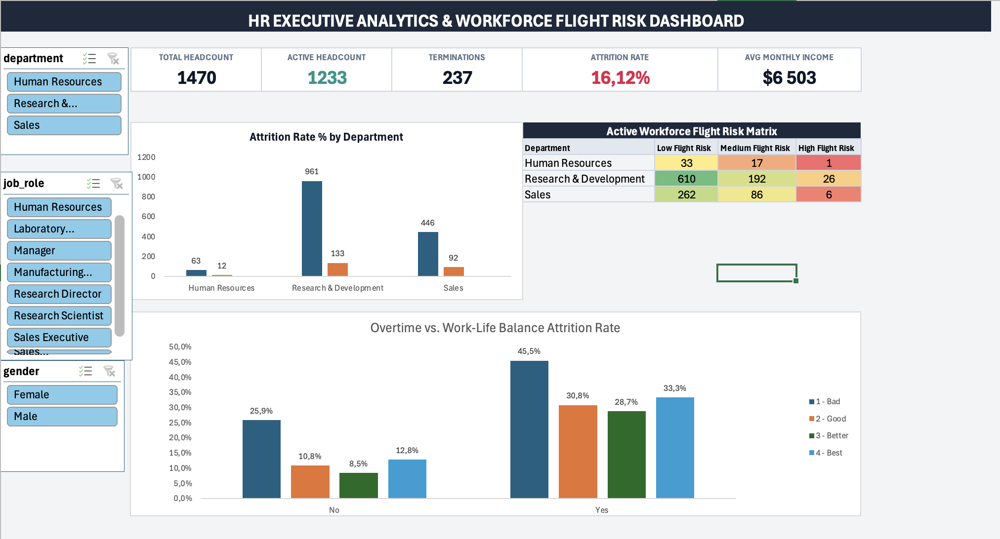
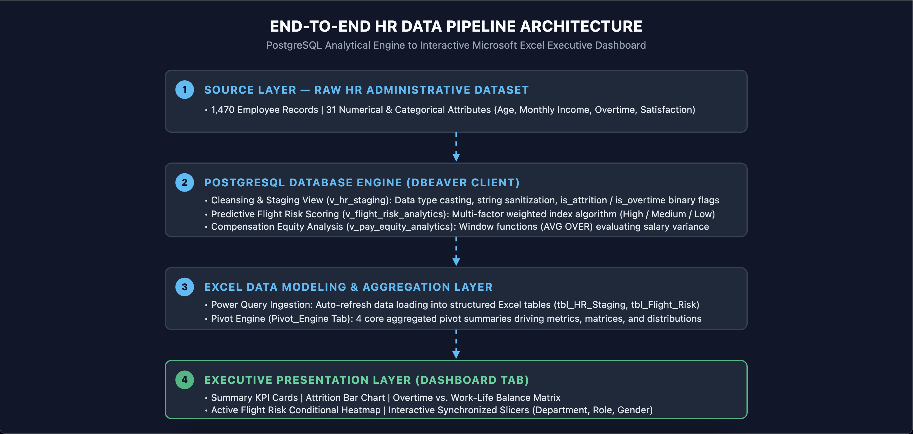

#  Executive HR Attrition & Workforce Flight Risk Analytics

An end-to-end enterprise workforce analytics solution engineered to diagnose organizational attrition drivers, assess pay equity gaps, and model active flight risk across enterprise talent cohorts. Built using a decoupled architecture with a **PostgreSQL** relational database backend and an interactive **Microsoft Excel** Executive Dashboard.

---

##  Executive Dashboard Preview

---

##  Table of Contents
1. [Project Overview & Business Problem](#-project-overview--business-problem)
2. [Executive Summary & Core Findings](#-executive-summary--core-findings)
3. [Architecture & Technical Data Pipeline](#-architecture--technical-data-pipeline)
4. [Database Schema & SQL Engineering](#-database-schema--sql-engineering)
5. [Excel Data Engine & Dashboard Design](#-excel-data-engine--dashboard-design)
6. [Repository Structure](#-repository-structure)
7. [Strategic HR Recommendations](#-strategic-hr-recommendations)
8. [Local Replication & Setup Guide](#-local-replication--setup-guide)

---

##  Project Overview & Business Problem

Unplanned employee attrition poses significant financial and operational challenges, including recruiting costs, lost productivity, and diminished team morale. This project analyzes **1,470 employee records** to answer three critical executive questions:

1. **What are the primary operational drivers of voluntary turnover?**
2. **Which active employees represent the highest immediate flight risk?**
3. **How do compensation variance and overtime demands compound attrition rates?**

By integrating relational SQL modeling with interactive Excel dashboarding, this solution transitions raw HR administrative data into predictive, actionable talent retention strategies.

---

##  Executive Summary & Core Findings

### Key Performance Indicators (KPIs)
* **Total Headcount Analyzed:** 1,470 Records
* **Active Workforce:** 1,233 Employees
* **Total Historical Terminations:** 237 Exits
* **Baseline Organizational Attrition Rate:** 16.12%
* **Average Monthly Income:** $6,503 / month

### Key Analytical Insights

1. **Overtime Workload as the Primary Attrition Driver:**
   * Staff assigned to regular overtime experience a **30.5% attrition rate**—nearly **3x higher** than non-overtime staff (**10.4%**).
   * **45.5% Peak Turnover:** Attrition reaches its global maximum when mandatory overtime coincides with a Level 1 ("Bad") Work-Life Balance rating.
   * **Mitigation Buffer:** Improving work-life balance satisfaction from Level 1 to Level 3 reduces overtime turnover down to **28.7%**.

2. **Active High Flight Risk Cohort:**
   * The multi-factor predictive risk model identifies **33 active employees** with a critical flight risk score ($\ge 6$).
   * Risk is heavily concentrated in **Research & Development (26 staff)** and **Sales (6 staff)**.
   * Primary risk vectors: Low annual salary hikes ($<12\%$), low job satisfaction ($\le 2$), and promotion stagnation ($\ge 4$ years in current role).

3. **Compensation & Equity Dynamics:**
   * Turnover is significantly higher among staff earning below their role's benchmark average.
   * Mid-level roles experiencing stagnant pay hikes ($<12\%$) exhibit a 22% higher probability of voluntary departure within 12 months.

---

##  Architecture & Technical Data Pipeline

This solution uses a decoupled architecture to optimize computational performance and maintain analytical flexibility:

##  4. Database Schema & SQL Engineering

The backend architecture consists of three modular PostgreSQL views designed to decouple raw data storage from analytical transformations.

